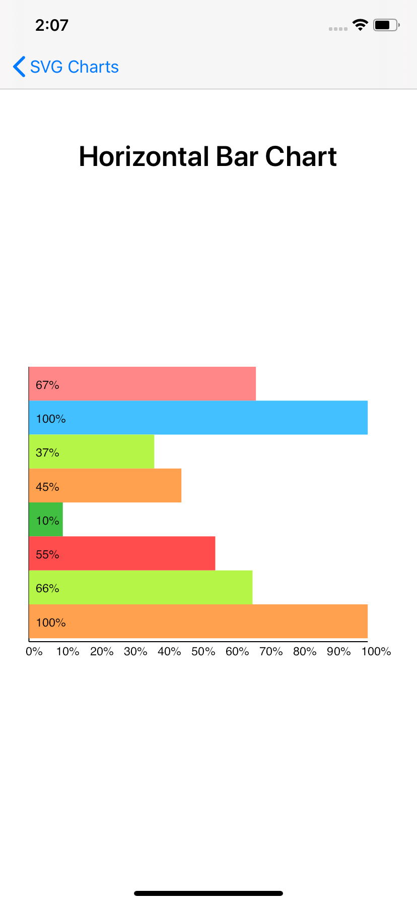
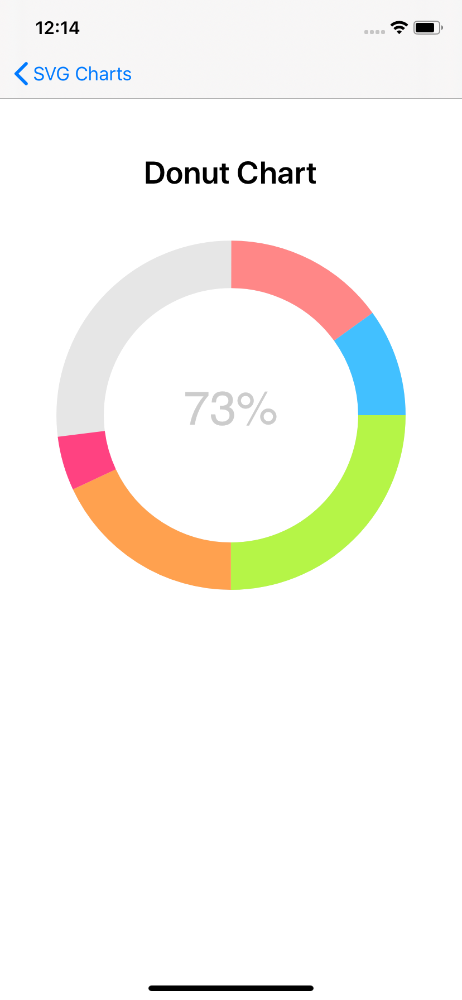
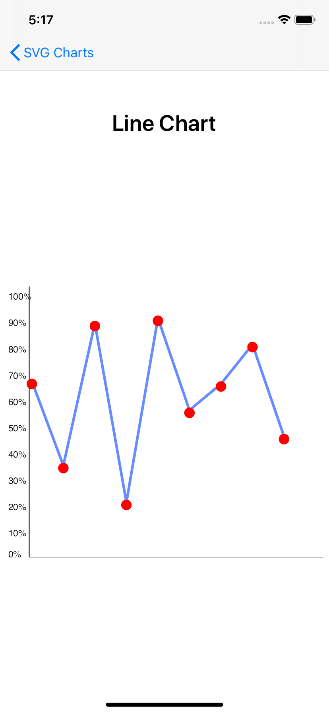

# SVG Chart

SVGChart is a library to create simple charts on Xamarin.Forms using a SVG file and SkiaSharp to display it.  
  
 ## How to use it?

You could clone this repository or simply add the NuGet package https://www.nuget.org/packages/SVGChart.Nuget

Just add the package reference and chart view.

```XAML
 xmlns:svgChart="clr-namespace:SVGChart.Nuget.Views;assembly=SVGChart.Nuget"

 <svgChart:VerticalBarChartView
                BarWidth="Medium"
                DisplayValue="False"
                HeightRequest="450"
                ItemSource="{Binding ChartValues}"
                WidthRequest="450" />
```

### Chart Options

- Horizontal Bar Chart.
- Donut Chart.
- Vertical Bar Chart.
- Line Chart

### Chart Properties
 * Horizontal Bar Chart.
  - DisplayValues
  - BarHeight
  
* Donut Chart.
  - RingColor
  - FillColor
  - TitleColor
  - ChartTitle
  - StrokeWidth
  
* Vertical Bar Chart.
  - DisplayValues
  - BarWidth
  
* Line Chart
  - LineColor
  - PointsColor
  - PointsDistance
  - PointSize
  - LineWidth
  - ShowPoints

For Horizontal and Vertical Bar Chart add the a list with the percentage and color of each bar.
```C#
new List<Tuple<int, string>>()
{
    new Tuple<int, string>(86, "#ff8787"),
    new Tuple<int, string>(100, "#42c0ff"),
    new Tuple<int, string>(37, "#b5f547"),
    new Tuple<int, string>(100, "#ffa14f"),
};
```

For Donut Chart add the a list with the percentage and color of each segment. 
```C#
new List<Tuple<int, string>>()
{
    new Tuple<int, string>(20, "#ff8787"),
    new Tuple<int, string>(10, "#42c0ff"),
    new Tuple<int, string>(35, "#b5f547")
};
```

For Line Chart just add a list of percentage for the position of each point. 

```C#
new List<int>()
{
   66,34,88,20,90,55,65,80,45
};
```

<p float="left">
  
  
  
  
</p>

### Copyright and license

Code released under the MIT license.
