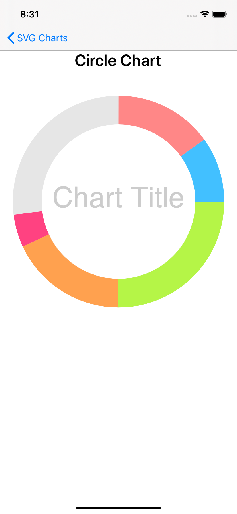
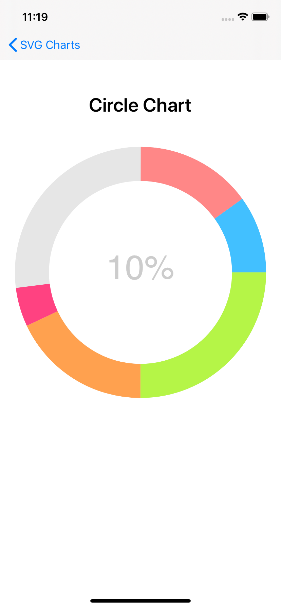
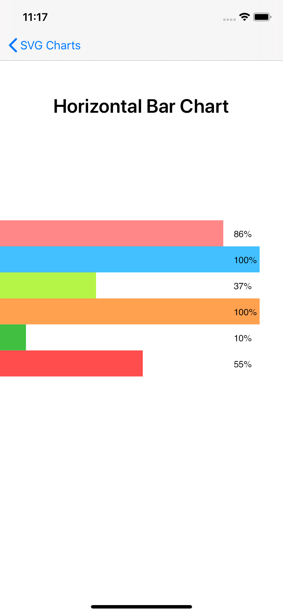
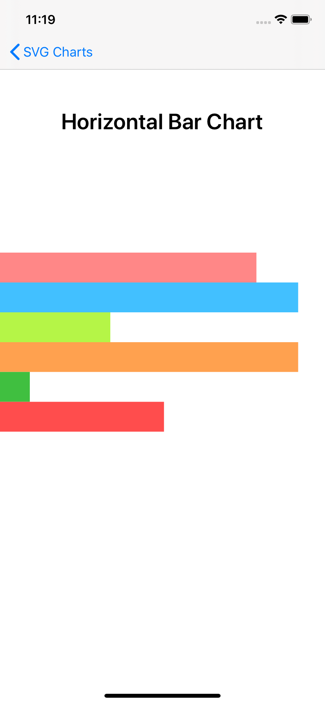
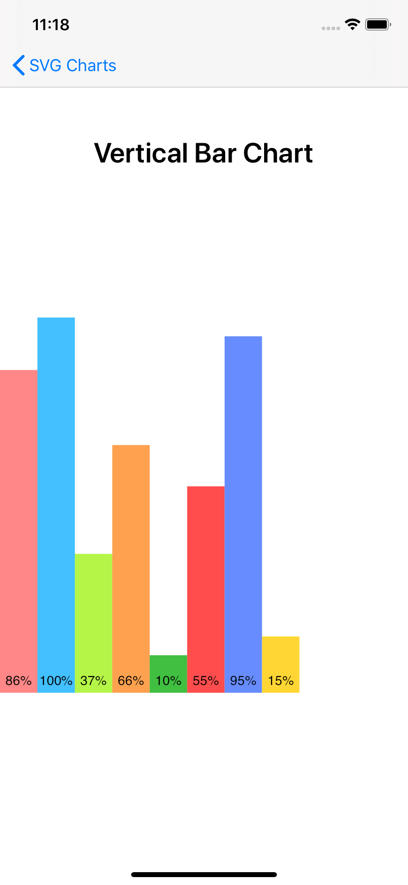
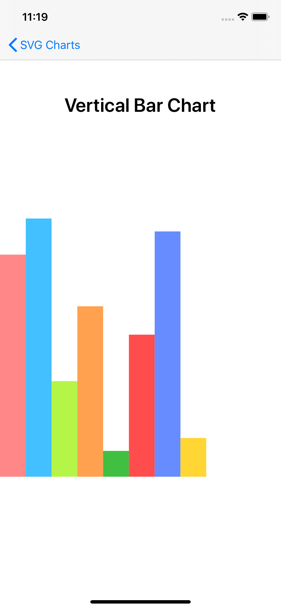

# SVGChart

Small sample about how to create a chart using a SVG file and SkiaSharp to display it.  
  
Just create a list of segments with the percentage and color 

```C#
new List<Tuple<int, string>>()
{
    new Tuple<int, string>(86, "#ff8787"),
    new Tuple<int, string>(100, "#42c0ff"),
    new Tuple<int, string>(37, "#b5f547"),
    new Tuple<int, string>(100, "#ffa14f"),
    new Tuple<int, string>(10, "#40bf40"),
    new Tuple<int, string>(55, "#ff4d4d")
};
```

## Chart Options
- Circle Chart.
- Horizontal Bar Chart.
- Vertical Bar Chart.

<p float="left">
  
  
  
  
  
  
</p>


